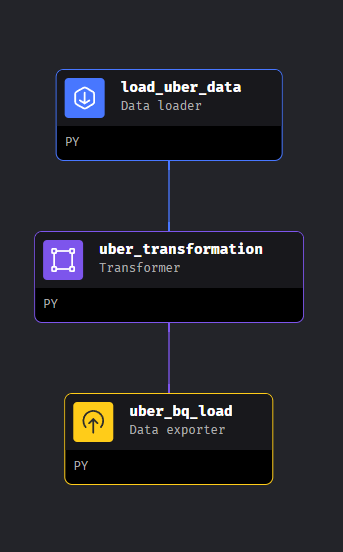

# NYC-uber-data-engineering-project-etl-pipeline

## Introduction

The objective of this project is to engage in data analytics on Uber data utilizing a range of tools and technologies. These include GCP Storage, Python, Compute Instance, Mage Data Pipeline Tool, BigQuery, and Looker Studio.

The project aims to address three primary inquiries:

1. What are the top 10 pickup locations ranked by the number of trips?
2. How many trips have been made based on passenger count?
3. How does the average amount vary across different hours of the day?

## Dataset Used

TLC Trip Record Data
The trip records for both yellow and green taxis encompass various fields that document pickup and drop-off dates/times, locations, distances, itemized fares, rate types, payment methods, and driver-reported passenger counts.

You can access the dataset through this: [Link](https://github.com/enochiankim/NYC-uber-data-engineering-project-etl-pipeline/tree/main/uber_raw_data)

For additional information about the dataset, refer to the following sources:

Website - https://www.nyc.gov/site/tlc/about/tlc-trip-record-data.page

Data Dictionary - https://www.nyc.gov/assets/tlc/downloads/pdf/data_dictionary_trip_records_yellow.pdf

## Utilized Technologies
Programming Language - Python

Google Cloud Platform Components:

1. Google Storage
2. Compute Instance 
3. BigQuery
4. Looker Studio

## Step 1: Developing the architectural framework for the project

## Step 2: Data Modeling and Constructing an Entity-Relationship Diagram to Enhance Data Comprehension

## Step 3: Developing the Transformation Code using Python

The code can be found here [Link](https://github.com/enochiankim/NYC-uber-data-engineering-project-etl-pipeline/blob/main/Uber%20Data%20Pipeline.ipynb)

## Step 4: Create a project and a Google Cloud Platform bucket, upload the data, designate the server, and configure the necessary permissions.

## Step 5: Generate a Virtual Machine Instance within GCP utilizing GCP Compute Engine.

Used the following command lines

sudo apt-get install update

sudo apt-get install python3-distutils

sudo apt-get install python3-apt

sudo apt-get install wget

wget https://bootstrap.pypa.io/get-pip.py

sudo python3 get-pip.py

## Step 6: Establish a connection between the VM and the Mage Project using SSH in the Linux Terminal, then initiate a Mage project (while also obtaining the required dependencies).

## Step 7: Construct a data pipeline using Mage Blocks such as data loader, transformer, and exporters. Integrate your transformation code into the data transformer, making the required modifications.

## Step 8: When the pipeline is prepared, include GCP credentials in the 'io_config.yaml' configuration file. Obtaining the credentials is straightforward through the APIs and Services section in the Google Console.

## Step 9: Employing BigQuery for data querying and executing ETL operations, enabling the data to be utilized for tasks such as data analysis, dashboard creation, and reporting.

## Step 10: Develop a dashboard using a dashboarding or reporting software; while Looker Studio was utilized, alternatives such as Power BI, Tableau, and more are viable options as well.

## Step 11: Answered SQL questions and query

What are the top 10 pickup locations ranked by the number of trips?

SELECT pickup_location_id, count(pickup_location_id) Trip_Num
FROM `uber_data_engineering_yt.fact_table` 
group by pickup_location_id
order by Trip_Num desc
LIMIT 10

How many trips have been made based on passenger count?

SELECT passenger_count, count(passenger_count) as passenger_trip
FROM `uber_data_engineering_yt.tbl_analytics`
group by passenger_count
order by passenger_trip desc

How does the average amount vary across different hours of the day?

SELECT d.pick_hour,round(avg(fare_amount),2) as fare
FROM `uber_data_engineering_yt.fact_table` f join 
`uber_data_engineering_yt.datetime_dim` d on f.datetime_id = d.datetime_id
group by d.pick_hour
order by fare desc

